
<h1 align="center">教学辅助系统</h1>

## 简介
教学辅助系统：基于Spring Boot开发，角色分为管理员、教师和学生；提供作业管理、教学视频、课程信息、通知公告、个人中心和交流平台等功能，实现高效的在线教学与管理。    --计算机毕业设计源码；毕设源码；java毕业设计源码

## 联系方式

<h3 align="center">获取完整代码与数据库文件 + 微信：deepguan QQ: 86050149 QQ群: 783742310</h3>

<h3 align="center">可帮忙远程部署 包运行成功！提供远程部署、修改代码、设计文档指导、代码讲解等服务！</h3>

## 功能介绍（完整见运行截图）
管理员：基本功能包括登录、注册和退出。平台上管理员可通过导航栏访问各模块，如交流平台、教学视频、课程信息等。管理员可管理教师信息，查看和修改教师的姓名、联系方式及头像等；在作业管理模块，管理员可查看作业的联系方式、题目和提交状态，并能对作业成绩进行管理。在教学视频管理中，管理员可以新增、删除视频并根据需要提供下载和详情查看功能。

教师：教师角色可通过登录界面进入系统，平台提供个人信息管理、课程管理和作业管理等功能。教师可以在教学视频管理模块发布和管理教学资源，支持视频搜索和类型筛选。在作业管理界面中，教师可查看学生提交的作业详情、成绩并进行评价与反馈。交流平台模块允许教师查看和发布帖子，为教学互动提供便利。

学生：学生通过登录界面注册和登录系统，进行个人资料管理及课程学习。学生可以上传和提交作业，查看反馈和成绩。在教学视频模块，学生可搜索所需教学视频，进行下载和查看，支持按视频类型筛选。公告区域提供课程信息及平台更新，学生可以根据需求进行搜索和过滤。此外，交流平台支持学生间的交流和问题讨论。

用户：用户涵盖系统的普通使用者，包括学生和教师，具备基础的登录、注册和退出功能。网站提供的交流平台，让用户发布与评论帖子用于交互交流；教学视频模块提供丰富的学习资源，支持查看和下载。用户可以通过各自角色权限访问相应的功能模块，如课程信息浏览、作业提交与管理。个人中心模块以简洁直观的设计，让用户管理个人信息及查看系统通知。

## 运行截图
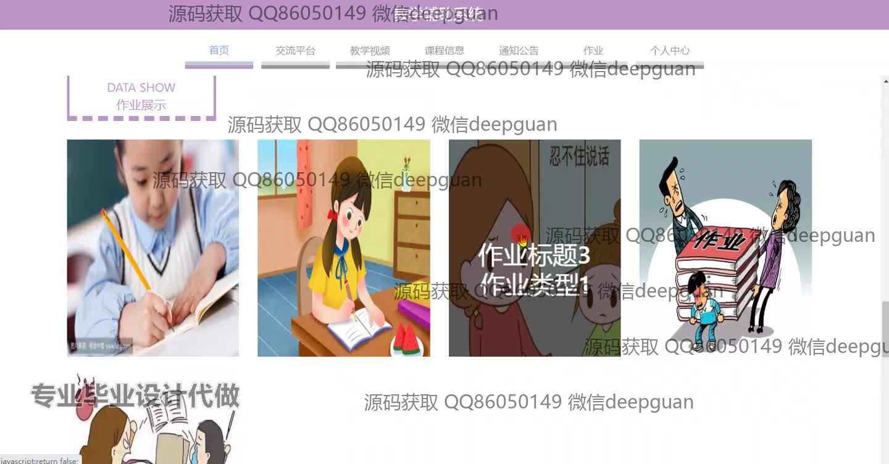
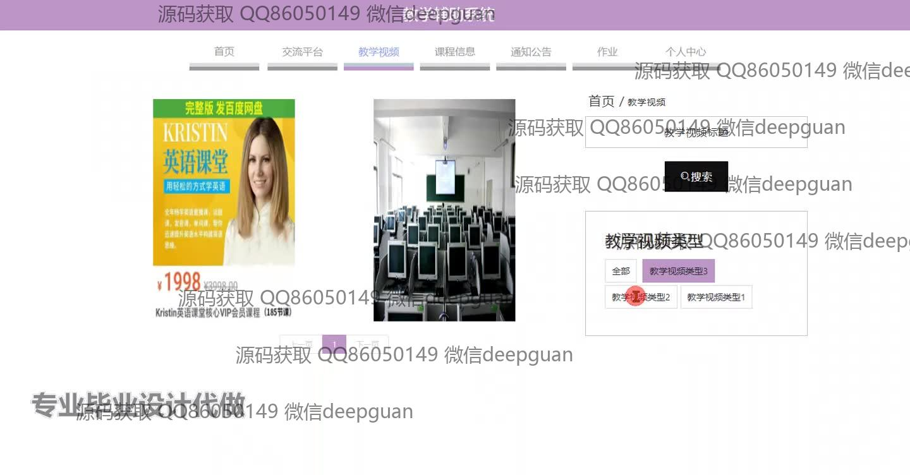
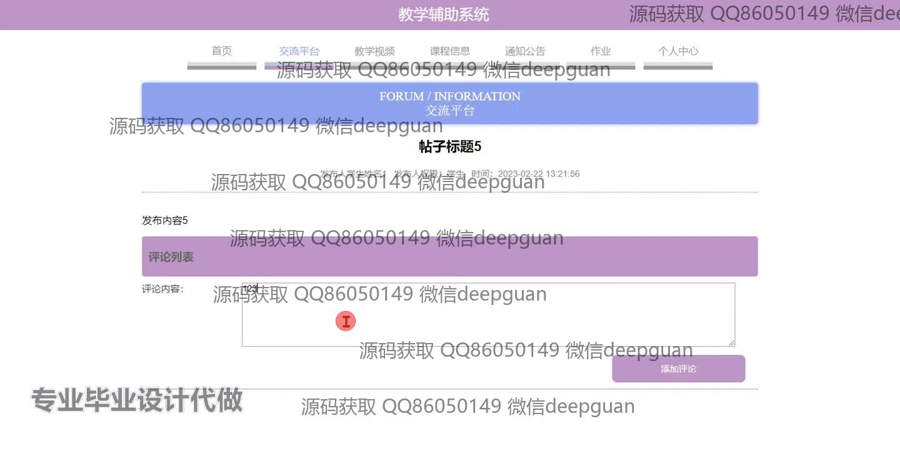
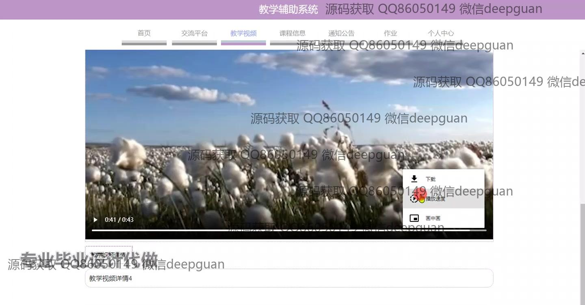
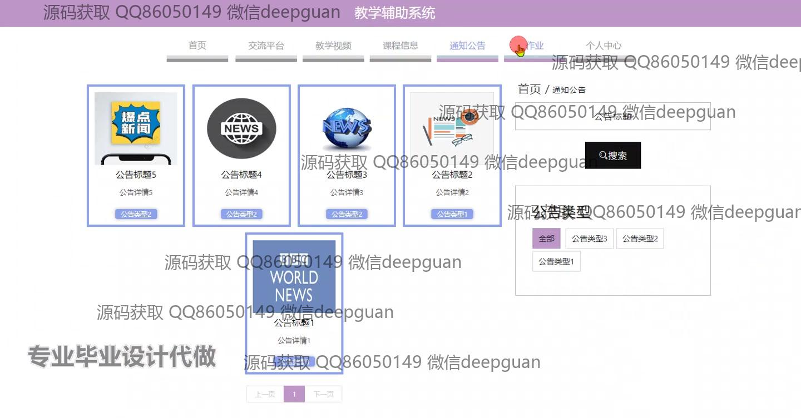
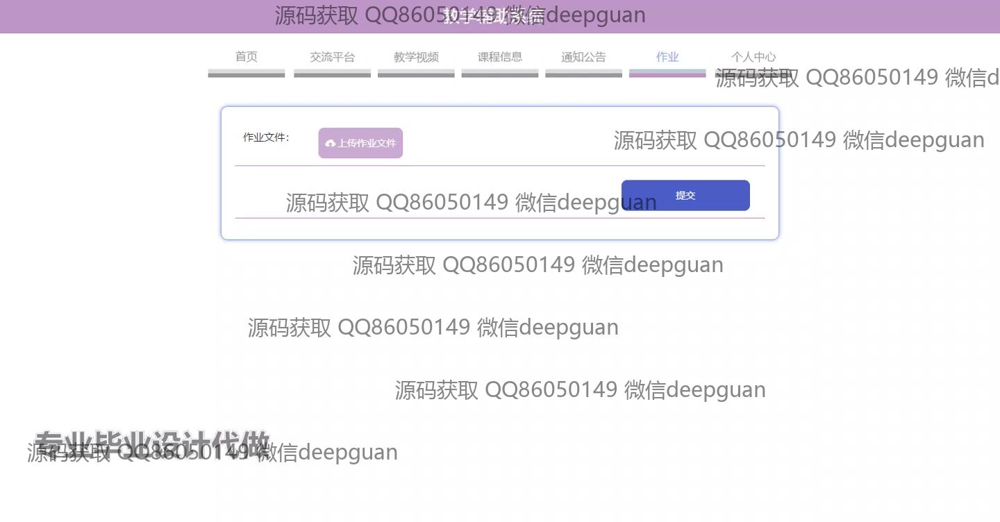
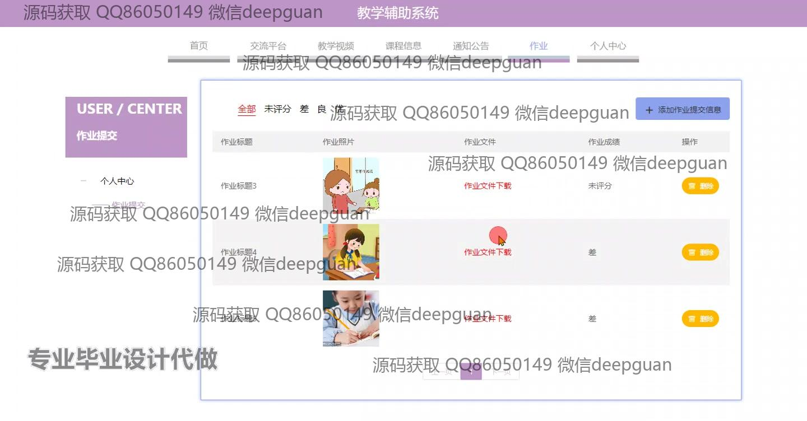
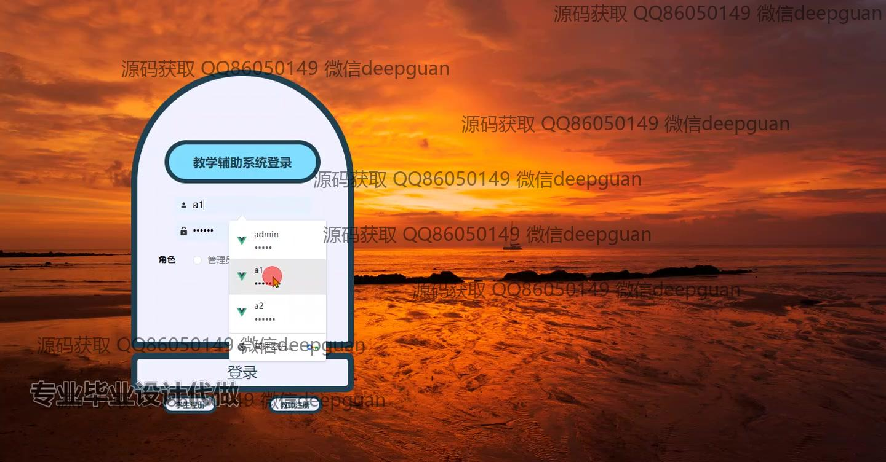
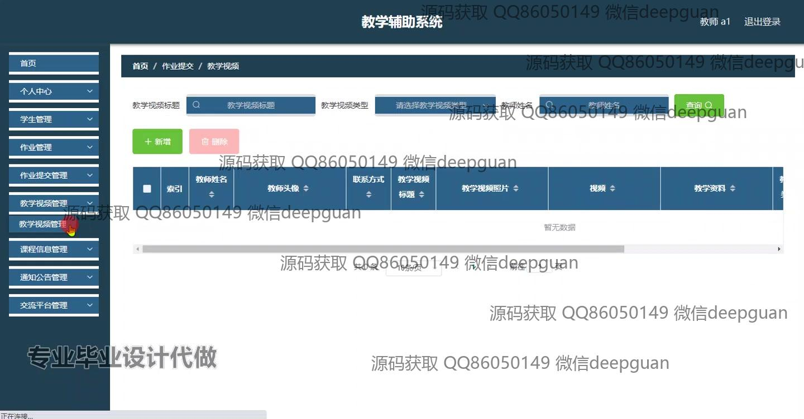
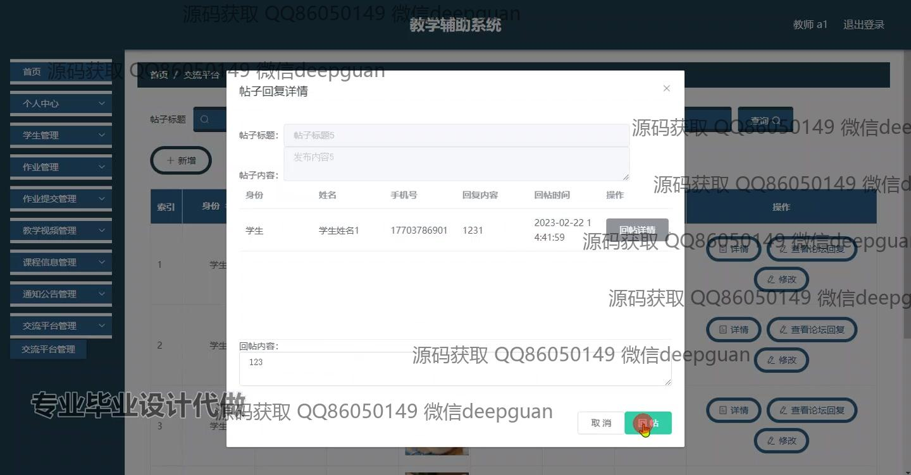
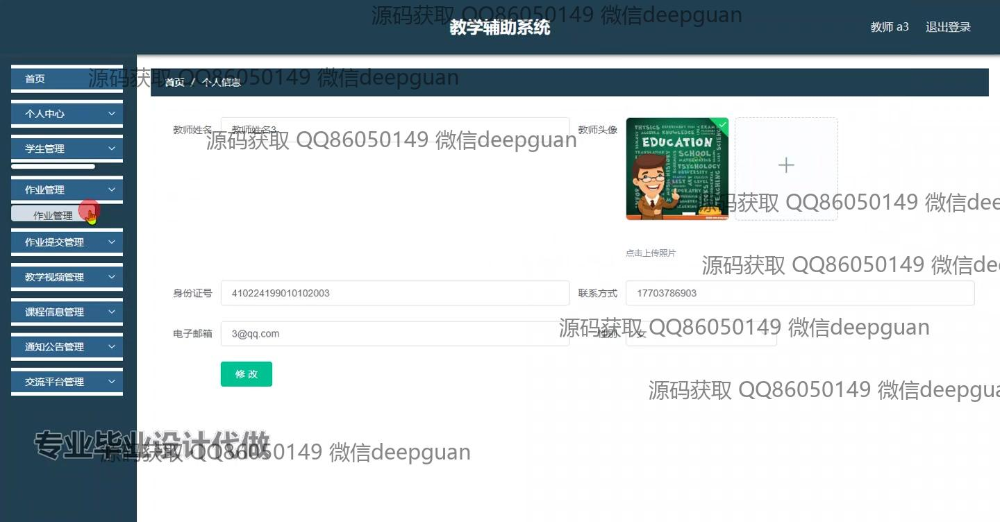
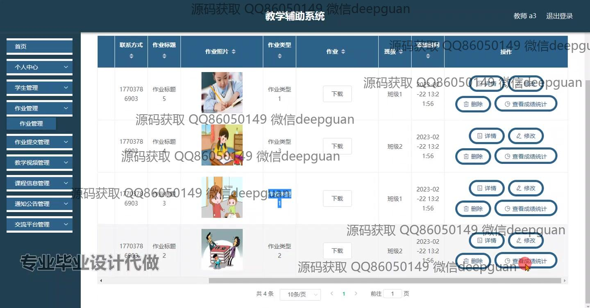
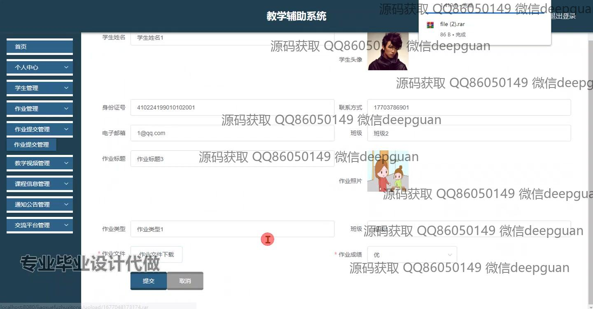
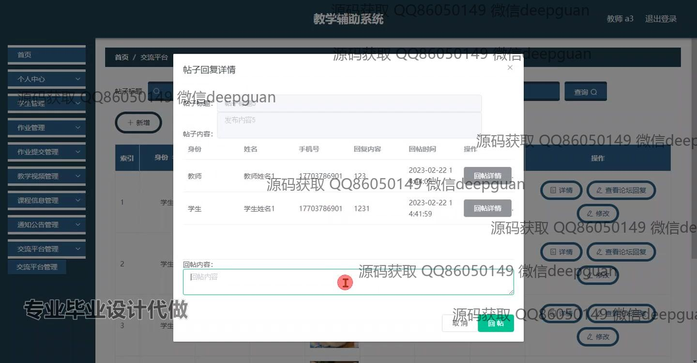
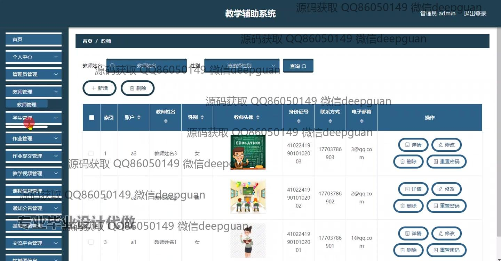
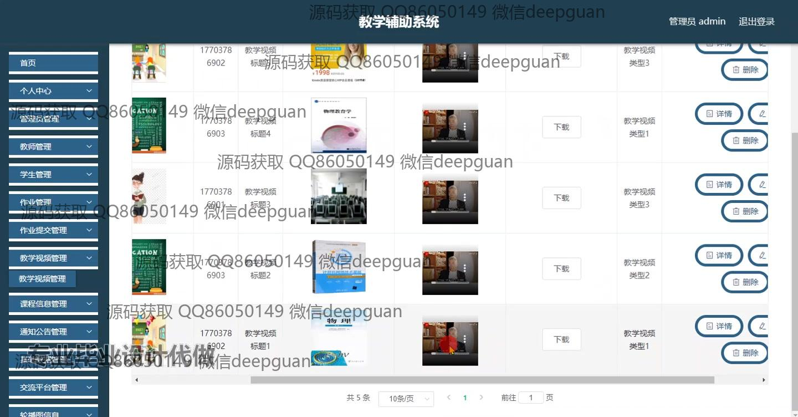
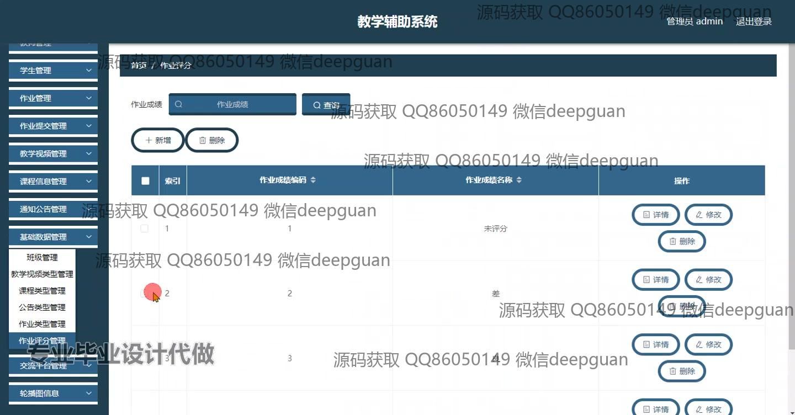
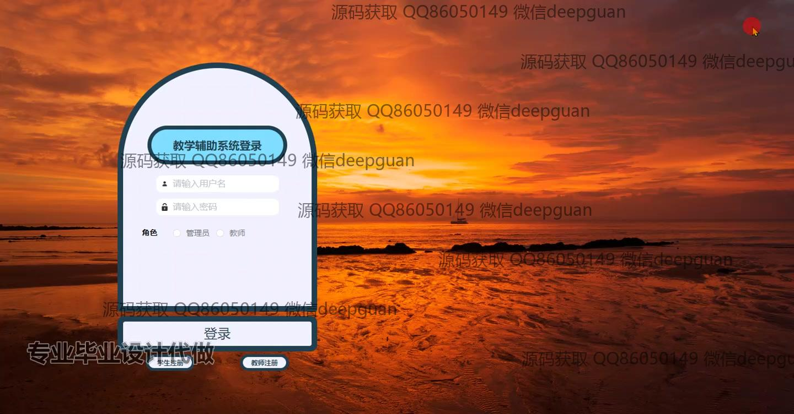

本代码来源于网络,仅供学习参考使用!

